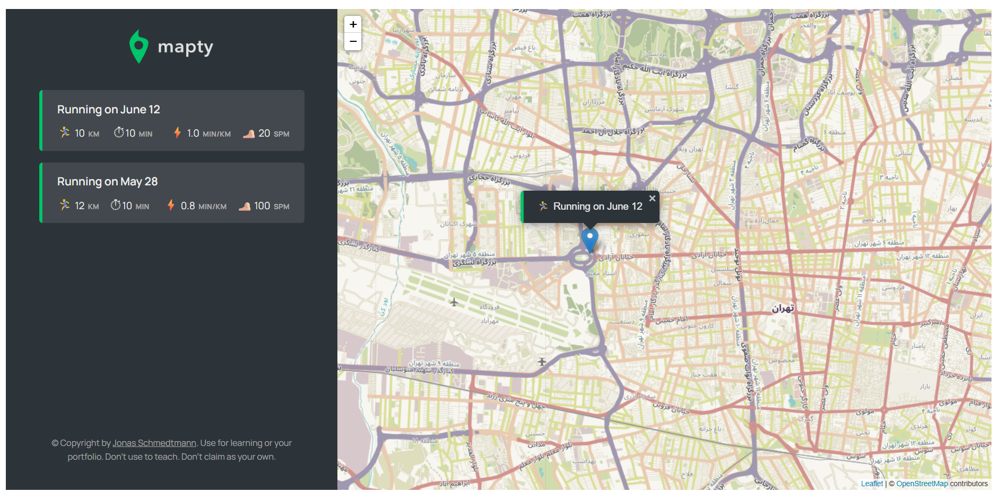

# 🗺️ Mapty

A modern workout tracking application built with JavaScript and interactive maps that allows users to log and manage their running and cycling workouts directly on a map.

Mapty combines fitness tracking with geolocation technology, making it easy to visualize workout history and monitor personal progress through an intuitive and engaging interface.

## 🚀 Live Demo

**Try it here:** https://mapty-desktop-only.vercel.app
**Try using a VPN if you are in Iran**


---

## 📸 Preview

### Header Section

```md

```

---


## ✨ Features

* 🗺️ Interactive map integration
* 🏃 Log running workouts
* 🚴 Log cycling workouts
* 📍 Store workout locations
* 📊 Track distance, duration, and pace
* ⚡ Instant workout rendering
* 💾 Persistent data storage using Local Storage
* 📱 Responsive and user-friendly interface

---

## 🛠️ Built With

* JavaScript (ES6+)
* HTML5
* CSS3
* Leaflet.js
* Geolocation API
* Local Storage API

---

## 📂 Project Structure

```text
mapty/
│
├── css/
├── img/
├── js/
│   └── script.js
│
├── index.html
└── README.md
```

---

## ⚙️ Installation

Clone the repository:

```bash
git clone https://github.com/MehdySadeghi/Mapty-DesktopOnly.git
```

Navigate to the project folder:

```bash
cd Mapty-DesktopOnly
```

Open the project in your preferred code editor and launch:

```text
index.html
```

You can also use VS Code Live Server for the best experience.

---

## 🎓 What I Learned

This project helped me strengthen my understanding of:

* Object-Oriented Programming (OOP)
* JavaScript classes and inheritance
* Browser Geolocation API
* Working with third-party libraries
* Interactive map integration
* Managing application state
* Local Storage persistence
* Writing scalable and maintainable JavaScript

---

## 🔮 Future Improvements

Planned enhancements include:

* Edit existing workouts
* Delete individual workouts
* Delete all workouts
* Workout filtering and sorting
* Dark mode support
* User authentication
* Cloud data synchronization
* Mobile optimization

---

## 🤝 Contributing

Contributions, suggestions, and feedback are welcome.

Feel free to fork the repository and submit a pull request.

---

## 📄 License

This project is open source and available under the MIT License.

---

## 👨‍💻 Author

### Mehdy Sadeghi

Passionate Front-End Developer focused on building modern, responsive, and user-friendly web applications.

GitHub:
https://github.com/MehdySadeghi

Repository:
https://github.com/MehdySadeghi/Mapty-DesktopOnly

---

### ⭐ If you found this project useful, consider giving it a star.
